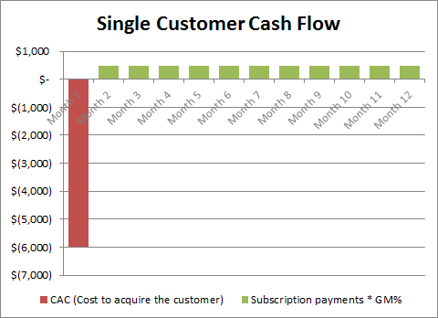
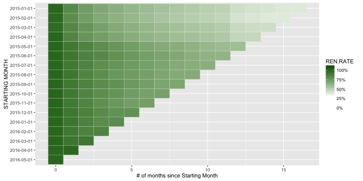
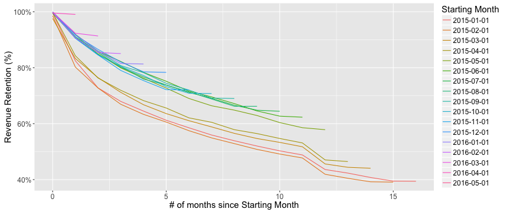

## Must have KPIs

Here are the KPIs (Key Performance Indicators) that every SaaS company must have. 

1. Recurring Revenue
2. Cost to Acquire the Customer (CAC)
3. Retention Rate

---

## Recurring Revenue & CAC

SaaS is a subscription business, so customers pay every month or every year. To make a profit, there needs to be steay cash flow for a minimum period to cover the cost of acquiring the customer.

Therefore, it is important that we not only acquire customers, but that they retain with us. 

_Source:_ [link](http://www.forentrepreneurs.com/saas-metrics-2/)

---

## Retention Rate

Retention Rate is that which is used to measure how well our customers are retaining and monitoring this will help assess how well my business is doing. 

Below is a heat map. 

---

## Revenue Retention Curves

The application will help monitor the health of my business. Below is a graph of the retention curves for only one of the products. 

Just based on this one view, it looks like customers are retaining better for this product.=)

